# Progress: Issue #3 — Phase 1: MVP Widget Extraction

## Status Dashboard

```mermaid
graph LR
    S1[Stage 1: Core Infra] -->|Complete ✓| S2[Stage 2: Data Layer]
    S2 -->|Complete ✓| S3[Stage 3: State & Nav]
    S3 -->|Complete ✓| S4[Stage 4: Effects]
    S4 -->|Complete ✓| S5[Stage 5: Charts]
    S5 -->|Complete ✓| S6[Stage 6: Public API]
    S6 -->|Complete ✓| S7[Stage 7: Demo Page]
    S7 -->|Complete ✓| DONE[Issue Closed]
```

## Stage Summary

| Stage | Title | Status | Commits |
|-------|-------|--------|---------|
| 1 | Core Infrastructure | **Complete** | 1da9d59 |
| 2 | Data Layer | **Complete** | fd95b90 |
| 3 | State & Navigation | **Complete** | be50a79 |
| 4 | Effects | **Complete** | 7a4c059 |
| 5 | Chart Builders | **Complete** | f4cb0b8 |
| 6 | Public API | **Complete** | 2e274fb |
| 7 | Demo Page | **Complete** | 5bf08af |

## Completion: 100% (7/7 stages)
