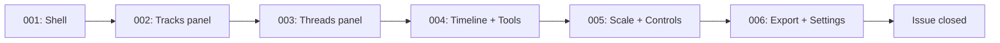

# Progress: Issue #5 — Phase 3: 4t-wizard

**Status:** Ready to implement — design complete

---

---

## Stages

| # | Title | Status |
|---|-------|--------|
| 001 | Shell: layout, Vue, store, preview, start dialog | **Complete** ✅ |
| 002 | Tracks panel: accordion CRUD, all track fields | **Complete** ✅ |
| 003 | Threads panel + preview navigation sync | **Complete** ✅ |
| 004 | Timeline and Tools panels | Planned ⏳ |
| 005 | Scale editor + controls | Planned ⏳ |
| 006 | Export, JSON drawer, settings, localStorage | Planned ⏳ |

---

## Timeline

| Stage | Started | Completed |
|-------|---------|-----------|
| Design | 2026-03-29 | 2026-03-29 |
| 001 | 2026-03-29 | 2026-03-29 |
| 002 | 2026-03-29 | 2026-03-29 |
| 003 | 2026-03-29 | 2026-03-29 |
| 004–006 | — | — |
