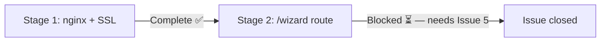

# Progress: Issue #8 — Phase 6: Self-hosted Demo

**Status:** In Progress — Stage 1 complete, Stage 2 blocked on Issue #5

---

---

## Stages

| # | Title | Status |
|---|-------|--------|
| 001 | nginx config + SSL + index.html live | **Complete** ✅ |
| 002 | /wizard route (after Phase 3) | Planned ⏳ |

---

## Live URLs

| URL | Status |
|-----|--------|
| `https://a1exma.online` | Live ✅ |
| `https://a1exma.online/wizard` | Pending Phase 3 ⏳ |

---

## Timeline

| Stage | Date | Notes |
|-------|------|-------|
| Stage 1 | 2026-03-29 | Ahead of original sequence — started before Phase 3 to enable UX design |
| Stage 2 | — | Blocked on Issue #5 |
