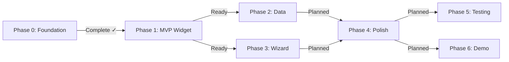

# Progress: Epic #1 — four-t v1.0 Initial Release

## Status Dashboard

## Child Issues Summary

| Issue | Phase | Title | Status | Progress |
|-------|-------|-------|--------|----------|
| #2 | 0 | Foundation & Documentation | **Complete** | 100% |
| #3 | 1 | MVP Widget Extraction | **Complete** | 100% |
| #4 | 2 | Example Data Completeness | **Complete** | 100% |
| #5 | 3 | 4t-wizard | Needs design session | 0% |
| #6 | 4 | Polish & CDN Delivery | Planned | 0% |
| #7 | 5 | Testing Infrastructure | Planned | 0% |
| #8 | 6 | Self-hosted Demo | Planned | 0% |

## Epic-Level Metrics

- Overall Progress: 43% (3/7 phases complete)
- Phases ready to implement: 0
- Phases requiring design: 1 (Phase 3)
- Phases planned: 3 (Phase 4, 5, 6)

## Timeline

| Phase | Started | Completed | Notes |
|-------|---------|-----------|-------|
| Phase 0 | 2026-03-28 | 2026-03-28 | Retrospective |
| Phase 1 | 2026-03-28 | 2026-03-28 | — |
| Phase 2 | 2026-03-28 | 2026-03-28 | — |
| Phase 3 | — | — | Requires design session |
| Phase 4–6 | — | — | Planned |
