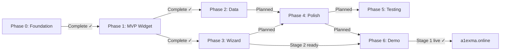

# Progress: Epic #1 — four-t v1.0 Initial Release

## Status Dashboard

## Child Issues Summary

| Issue | Phase | Title | Status | Progress |
|-------|-------|-------|--------|----------|
| #2 | 0 | Foundation & Documentation | **Complete** | 100% |
| #3 | 1 | MVP Widget Extraction | **Complete** | 100% |
| #4 | 2 | Example Data Completeness | **Complete** | 100% |
| #5 | 3 | 4t-wizard | **Complete** | 100% |
| #6 | 4 | Polish & CDN Delivery | Planned | 0% |
| #7 | 5 | Testing Infrastructure | Planned | 0% |
| #8 | 6 | Self-hosted Demo | **In Progress** (Stage 1 complete, Stage 2 ready) | 50% |

## Epic-Level Metrics

- Overall Progress: ~65% (4/7 phases complete + Phase 6 Stage 1 live)
- Phases ready to implement: 1 (Phase 6 Stage 2 — wizard route, unblocked)
- Phases planned: 2 (Phase 4, 5)
- Phases in progress: 1 (Phase 6 — Stage 2 now unblocked)

## Timeline

| Phase | Started | Completed | Notes |
|-------|---------|-----------|-------|
| Phase 0 | 2026-03-28 | 2026-03-28 | Retrospective |
| Phase 1 | 2026-03-28 | 2026-03-28 | — |
| Phase 2 | 2026-03-28 | 2026-03-28 | — |
| Phase 3 | 2026-03-29 | 2026-03-29 | 6 stages, all complete |
| Phase 4–5 | — | — | Planned |
| Phase 6 | 2026-03-29 | — | Stage 1 live; Stage 2 ready (Issue #5 complete) |

## Notes

Phase 6 was started ahead of schedule (before Phase 3) to provide a live demo
for UX design work on the wizard. See `child-8-phase-6-demo/design.md` — D4
for rationale. Stage 2 (wizard route) is now unblocked after Issue #5 completion.
